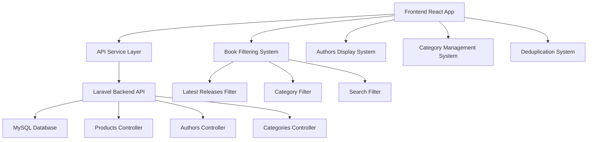

# Book Filtering and Display Fixes - Design Document

## Overview

This design addresses critical filtering issues in the Sterling Publishers e-commerce application by implementing proper latest releases filtering, adding authors functionality, ensuring complete category display, and fixing book deduplication problems. The solution involves both frontend and backend improvements to create a seamless book browsing experience.

## Architecture

### System Components



### Data Flow

1. **Book Filtering Flow**: User selects filters → Frontend validates and formats parameters → API receives structured request → Database query with proper joins → Filtered results returned → Frontend deduplicates and displays
2. **Authors Flow**: User visits authors page → Frontend requests authors list → Backend queries authors with book counts → Frontend displays authors grid → User clicks author → Books filtered by author
3. **Category Flow**: User browses categories → Frontend requests categories with book counts → Backend returns active categories only → Frontend displays category grid with accurate counts

## Components and Interfaces

### Backend API Enhancements

#### New Authors Controller
```php
class AuthorsController extends Controller
{
    public function getAuthors(Request $request)
    {
        // Return authors with book counts and basic info
        // Support search and pagination
    }
    
    public function getAuthorBooks($authorId, Request $request)
    {
        // Return books by specific author with filtering support
    }
}
```

#### Enhanced Products Controller
```php
class ApiController extends Controller
{
    public function getProducts(Request $request)
    {
        // Improved filtering logic for latest releases
        // Better category filtering with subcategory support
        // Enhanced deduplication at database level
    }
}
```

#### Enhanced Menu Controller
```php
class MenuController extends Controller
{
    public function getCategories()
    {
        // Return categories with accurate book counts
        // Include subcategories with their counts
        // Filter out empty categories
    }
}
```

### Frontend Component Updates

#### Enhanced AllBooks Component
- Fix latest releases filtering logic
- Improve category parameter handling
- Better error states and loading indicators
- Enhanced deduplication system

#### New Authors Components
- AuthorsGrid: Display authors in grid layout
- AuthorCard: Individual author display component
- AuthorBooks: Books by specific author page

#### Enhanced Category Components
- CategoryGrid: Display all available categories
- CategoryFilter: Improved filtering with subcategories
- BooksByCategory: Category-specific book display

### API Endpoints

#### New Endpoints
```
GET /api/authors - Get all authors with book counts
GET /api/authors/{id}/books - Get books by specific author
GET /api/authors/search - Search authors by name
```

#### Enhanced Endpoints
```
GET /api/products - Enhanced filtering for latest releases
GET /api/categories - Include accurate book counts
GET /api/products/{id} - Include author information
```

## Data Models

### Enhanced Product Model
```typescript
interface Book {
  id: string;
  title: string;
  slug: string;
  description: string;
  price: number;
  images: string[];
  authors: Author[];
  category_id: string;
  subcategory_id?: string;
  is_latest_release: boolean; // Key field for filtering
  stock_status: string;
  publication_date: string;
}
```

### New Author Model
```typescript
interface Author {
  id: string;
  name: string;
  slug: string;
  bio?: string;
  book_count: number;
  avatar?: string;
}
```

### Enhanced Category Model
```typescript
interface Category {
  id: string;
  name: string;
  slug: string;
  book_count: number; // Accurate count from database
  children: SubCategory[];
}

interface SubCategory {
  id: string;
  name: string;
  slug: string;
  book_count: number;
  parent_id: string;
}
```

## Error Handling

### Backend Error Handling
- Validate filter parameters before database queries
- Handle empty result sets gracefully
- Provide meaningful error messages for invalid requests
- Log filtering errors for debugging

### Frontend Error Handling
- Display user-friendly messages for API failures
- Provide retry mechanisms for failed requests
- Show loading states during filter operations
- Handle empty states with helpful guidance

### Specific Error Scenarios
1. **No Latest Releases**: Show message encouraging users to check back later
2. **No Authors Found**: Display message about authors being added soon
3. **Empty Categories**: Hide categories with zero books
4. **Filter Conflicts**: Clear conflicting filters automatically

## Testing Strategy

### Backend Testing
- Unit tests for filtering logic in controllers
- Integration tests for API endpoints with various filter combinations
- Database tests for accurate book counts in categories
- Performance tests for complex filter queries

### Frontend Testing
- Component tests for filtering UI elements
- Integration tests for API service calls
- User interaction tests for filter combinations
- Visual regression tests for book grid layouts

### End-to-End Testing
- Complete user journeys through filtering workflows
- Latest releases page functionality
- Authors page browsing and search
- Category navigation and book discovery

### Test Scenarios
1. **Latest Releases Filtering**: Verify only latest releases appear
2. **Author Search**: Test author search and book filtering by author
3. **Category Browsing**: Ensure all categories with books are visible
4. **Deduplication**: Verify no duplicate books in any view
5. **Combined Filters**: Test multiple filter combinations

## Performance Considerations

### Database Optimization
- Add indexes on filtering columns (is_latest_release, category_id, author_id)
- Optimize category book count queries
- Use database-level deduplication where possible
- Cache frequently accessed category and author data

### Frontend Optimization
- Implement debounced search for authors
- Use React Query for efficient data caching
- Lazy load author images and book covers
- Optimize re-renders during filtering operations

### Caching Strategy
- Cache category data with book counts for 30 minutes
- Cache author lists for 1 hour
- Invalidate caches when books are added/updated
- Use Redis for production caching if available

## Security Considerations

### Input Validation
- Sanitize all filter parameters
- Validate category and author IDs
- Prevent SQL injection in search queries
- Rate limit search and filter requests

### Data Access
- Ensure only active books are returned
- Validate user permissions for admin endpoints
- Protect against enumeration attacks on author/category IDs
- Implement proper CORS policies for API access