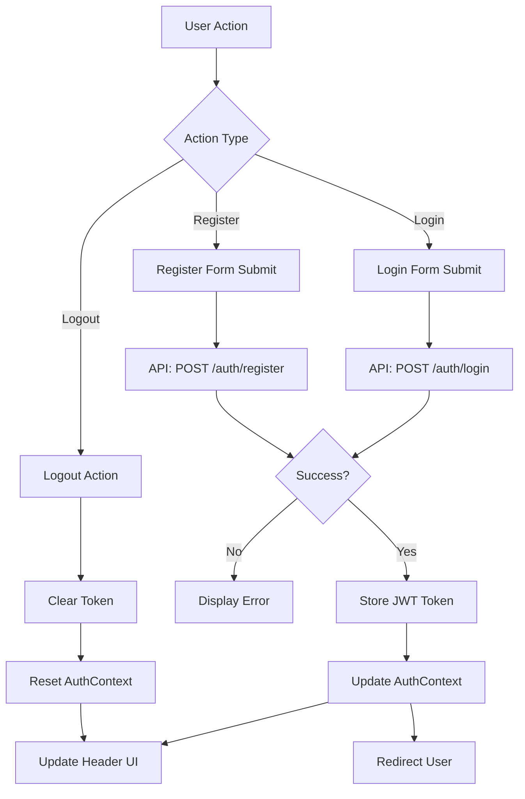

# Design Document

## Overview

The user authentication feature will provide secure login and registration functionality for the bookstore application. The implementation will follow React best practices using TypeScript, React Hook Form for form management, and integrate with a RESTful API backend. The design leverages existing UI components from shadcn/ui to maintain visual consistency with the current application.

The authentication system will use JWT (JSON Web Token) based authentication, storing tokens in localStorage for session persistence. The design includes an AuthContext for global authentication state management, protected route components, and seamless integration with the existing CartContext to preserve user cart data across authentication state changes.

## Architecture

### Component Structure

```
src/
├── context/
│   └── AuthContext.tsx          # Authentication state management
├── pages/
│   ├── Login.tsx                # Login page component
│   └── Register.tsx             # Registration page component
├── components/
│   ├── Header.tsx               # Updated with auth UI
│   └── ProtectedRoute.tsx       # Route wrapper for authenticated pages
├── services/
│   └── api.ts                   # Updated with auth API calls
└── lib/
    └── auth.ts                  # Authentication utilities
```

### State Management Flow



### Authentication Flow

1. **Registration Flow**:
   - User fills registration form (name, email, password, confirm password)
   - Client-side validation checks all fields
   - POST request to `/api/auth/register` with user data
   - Backend creates user account and returns JWT token
   - Token stored in localStorage
   - User automatically logged in and redirected

2. **Login Flow**:
   - User fills login form (email, password)
   - Client-side validation checks fields
   - POST request to `/api/auth/login` with credentials
   - Backend validates credentials and returns JWT token
   - Token stored in localStorage
   - Cart items preserved and merged if applicable
   - User redirected to intended page or home

3. **Session Persistence**:
   - On app load, check localStorage for token
   - If token exists, validate with backend
   - If valid, restore authenticated state
   - If invalid/expired, clear token and show logged out state

4. **Logout Flow**:
   - User clicks logout
   - Clear token from localStorage
   - Reset AuthContext state
   - Redirect to home page

## Components and Interfaces

### AuthContext

**Purpose**: Manage global authentication state and provide auth methods to all components

**Interface**:
```typescript
interface User {
  id: string;
  name: string;
  email: string;
}

interface AuthState {
  user: User | null;
  token: string | null;
  isAuthenticated: boolean;
  isLoading: boolean;
}

interface AuthContextType {
  state: AuthState;
  login: (email: string, password: string) => Promise<void>;
  register: (name: string, email: string, password: string) => Promise<void>;
  logout: () => void;
  checkAuth: () => Promise<void>;
}
```

**Key Methods**:
- `login(email, password)`: Authenticate user and store token
- `register(name, email, password)`: Create new account and auto-login
- `logout()`: Clear authentication state
- `checkAuth()`: Validate existing token on app load

### Login Page Component

**Location**: `src/pages/Login.tsx`

**Features**:
- Email and password input fields
- Form validation with react-hook-form
- Error message display
- Loading state during API call
- Link to registration page
- "Remember me" option (optional)

**Form Schema**:
```typescript
const loginSchema = z.object({
  email: z.string().email('Invalid email address'),
  password: z.string().min(1, 'Password is required'),
});
```

### Register Page Component

**Location**: `src/pages/Register.tsx`

**Features**:
- Full name, email, password, and confirm password fields
- Real-time password strength indicator
- Form validation with react-hook-form
- Error message display
- Loading state during API call
- Link to login page

**Form Schema**:
```typescript
const registerSchema = z.object({
  name: z.string().min(2, 'Name must be at least 2 characters'),
  email: z.string().email('Invalid email address'),
  password: z.string()
    .min(8, 'Password must be at least 8 characters')
    .regex(/[A-Z]/, 'Password must contain at least one uppercase letter')
    .regex(/[a-z]/, 'Password must contain at least one lowercase letter')
    .regex(/[0-9]/, 'Password must contain at least one number'),
  confirmPassword: z.string(),
}).refine((data) => data.password === data.confirmPassword, {
  message: "Passwords don't match",
  path: ["confirmPassword"],
});
```

### Header Component Updates

**Changes**:
- Add conditional rendering based on authentication state
- Show user name/email when authenticated
- Display dropdown menu with logout option
- Show login/register links when not authenticated
- Hide login/register links on respective pages

**UI Elements**:
```typescript
// When authenticated
<DropdownMenu>
  <DropdownMenuTrigger>
    <User className="h-4 w-4" />
    <span>{user.name}</span>
  </DropdownMenuTrigger>
  <DropdownMenuContent>
    <DropdownMenuItem>Profile</DropdownMenuItem>
    <DropdownMenuItem>Orders</DropdownMenuItem>
    <DropdownMenuSeparator />
    <DropdownMenuItem onClick={logout}>Logout</DropdownMenuItem>
  </DropdownMenuContent>
</DropdownMenu>

// When not authenticated
<div className="flex gap-2">
  <Button variant="ghost" asChild>
    <Link to="/login">Login</Link>
  </Button>
  <Button asChild>
    <Link to="/register">Sign Up</Link>
  </Button>
</div>
```

### ProtectedRoute Component

**Purpose**: Wrapper component to protect routes requiring authentication

**Implementation**:
```typescript
interface ProtectedRouteProps {
  children: React.ReactNode;
  redirectTo?: string;
}

const ProtectedRoute: React.FC<ProtectedRouteProps> = ({ 
  children, 
  redirectTo = '/login' 
}) => {
  const { state } = useAuth();
  const location = useLocation();

  if (state.isLoading) {
    return <LoadingSpinner />;
  }

  if (!state.isAuthenticated) {
    return <Navigate to={redirectTo} state={{ from: location }} replace />;
  }

  return <>{children}</>;
};
```

## Data Models

### User Model

```typescript
interface User {
  id: string;
  name: string;
  email: string;
  createdAt?: string;
  updatedAt?: string;
}
```

### Authentication Request/Response Models

```typescript
// Login Request
interface LoginRequest {
  email: string;
  password: string;
}

// Register Request
interface RegisterRequest {
  name: string;
  email: string;
  password: string;
  password_confirmation: string;
}

// Auth Response
interface AuthResponse {
  user: User;
  token: string;
  message?: string;
}

// Error Response
interface ErrorResponse {
  message: string;
  errors?: Record<string, string[]>;
}
```

## API Integration

### Authentication Service

**Location**: `src/services/api.ts` (extend existing file)

**Endpoints**:

1. **POST /api/auth/register**
   - Request Body: `{ name, email, password, password_confirmation }`
   - Response: `{ user, token }`
   - Status Codes: 201 (Created), 422 (Validation Error)

2. **POST /api/auth/login**
   - Request Body: `{ email, password }`
   - Response: `{ user, token }`
   - Status Codes: 200 (OK), 401 (Unauthorized), 422 (Validation Error)

3. **POST /api/auth/logout**
   - Headers: `Authorization: Bearer {token}`
   - Response: `{ message }`
   - Status Codes: 200 (OK), 401 (Unauthorized)

4. **GET /api/auth/me**
   - Headers: `Authorization: Bearer {token}`
   - Response: `{ user }`
   - Status Codes: 200 (OK), 401 (Unauthorized)

**Service Implementation**:
```typescript
export const AuthService = {
  register: async (data: RegisterRequest): Promise<ApiResponse<AuthResponse>> => {
    const response = await fetch(`${API_BASE_URL}/auth/register`, {
      method: 'POST',
      headers: { 'Content-Type': 'application/json' },
      body: JSON.stringify(data),
    });
    
    if (!response.ok) {
      const error = await response.json();
      throw new Error(error.message || 'Registration failed');
    }
    
    return response.json();
  },

  login: async (data: LoginRequest): Promise<ApiResponse<AuthResponse>> => {
    const response = await fetch(`${API_BASE_URL}/auth/login`, {
      method: 'POST',
      headers: { 'Content-Type': 'application/json' },
      body: JSON.stringify(data),
    });
    
    if (!response.ok) {
      const error = await response.json();
      throw new Error(error.message || 'Login failed');
    }
    
    return response.json();
  },

  logout: async (token: string): Promise<void> => {
    await fetch(`${API_BASE_URL}/auth/logout`, {
      method: 'POST',
      headers: { 
        'Authorization': `Bearer ${token}`,
        'Content-Type': 'application/json'
      },
    });
  },

  getCurrentUser: async (token: string): Promise<ApiResponse<User>> => {
    const response = await fetch(`${API_BASE_URL}/auth/me`, {
      headers: { 'Authorization': `Bearer ${token}` },
    });
    
    if (!response.ok) {
      throw new Error('Failed to fetch user');
    }
    
    return response.json();
  },
};
```

### HTTP Interceptor

Add authorization header to all authenticated requests:

```typescript
// lib/auth.ts
export const getAuthHeader = (): Record<string, string> => {
  const token = localStorage.getItem('auth_token');
  return token ? { 'Authorization': `Bearer ${token}` } : {};
};

// Usage in API calls
const response = await fetch(url, {
  headers: {
    'Content-Type': 'application/json',
    ...getAuthHeader(),
  },
});
```

## Error Handling

### Client-Side Validation Errors

- Display inline error messages below form fields
- Use react-hook-form's error state
- Show errors in red text with appropriate icons
- Clear errors when user corrects input

### API Error Handling

**Error Types**:
1. **Validation Errors (422)**: Display field-specific errors
2. **Authentication Errors (401)**: Show "Invalid credentials" message
3. **Server Errors (500)**: Show generic error message
4. **Network Errors**: Show "Connection failed" message

**Implementation**:
```typescript
try {
  await AuthService.login(data);
} catch (error) {
  if (error instanceof Error) {
    // Check for specific error types
    if (error.message.includes('credentials')) {
      setError('root', { message: 'Invalid email or password' });
    } else if (error.message.includes('network')) {
      setError('root', { message: 'Connection failed. Please try again.' });
    } else {
      setError('root', { message: error.message });
    }
  }
}
```

### Token Expiration Handling

- Detect 401 responses on authenticated requests
- Clear stored token
- Redirect to login page
- Show "Session expired" message
- Preserve intended destination for post-login redirect

## Testing Strategy

### Unit Tests

1. **AuthContext Tests**:
   - Test login method with valid credentials
   - Test login method with invalid credentials
   - Test register method with valid data
   - Test register method with duplicate email
   - Test logout method clears state
   - Test checkAuth with valid token
   - Test checkAuth with invalid token

2. **Form Validation Tests**:
   - Test email validation (valid/invalid formats)
   - Test password length validation
   - Test password strength requirements
   - Test password confirmation matching
   - Test required field validation

3. **Component Tests**:
   - Test Login page renders correctly
   - Test Register page renders correctly
   - Test form submission with valid data
   - Test form submission with invalid data
   - Test error message display
   - Test navigation links work correctly

### Integration Tests

1. **Authentication Flow Tests**:
   - Test complete registration flow
   - Test complete login flow
   - Test logout flow
   - Test session persistence across page refresh
   - Test cart preservation after login

2. **Protected Route Tests**:
   - Test authenticated user can access protected routes
   - Test unauthenticated user redirected to login
   - Test redirect back to intended page after login

3. **Header Integration Tests**:
   - Test header shows correct UI when authenticated
   - Test header shows correct UI when not authenticated
   - Test logout button works correctly
   - Test navigation links update based on auth state

### Manual Testing Checklist

- [ ] Register new account with valid data
- [ ] Register with existing email shows error
- [ ] Register with weak password shows error
- [ ] Login with valid credentials succeeds
- [ ] Login with invalid credentials shows error
- [ ] Session persists after page refresh
- [ ] Logout clears session correctly
- [ ] Cart items preserved after login
- [ ] Protected routes redirect when not authenticated
- [ ] Header UI updates correctly based on auth state
- [ ] Form validation messages display correctly
- [ ] Password strength indicator works
- [ ] Navigation between login/register pages works
- [ ] Mobile responsive design works correctly

## Security Considerations

1. **Password Security**:
   - Minimum 8 characters required
   - Must include uppercase, lowercase, and number
   - Never log or display passwords
   - Use password input type to mask characters

2. **Token Storage**:
   - Store JWT in localStorage (acceptable for this use case)
   - Include token expiration time
   - Clear token on logout
   - Validate token on app load

3. **API Security**:
   - Use HTTPS in production
   - Include CSRF protection if using cookies
   - Validate all inputs on backend
   - Rate limit authentication endpoints

4. **XSS Prevention**:
   - React automatically escapes content
   - Avoid dangerouslySetInnerHTML
   - Sanitize any user-generated content

## UI/UX Design

### Visual Design

- Use existing shadcn/ui components for consistency
- Follow current color scheme and typography
- Maintain responsive design for mobile devices
- Use loading spinners during API calls
- Show success messages after registration

### Form Layout

**Login Page**:
```
┌─────────────────────────────────┐
│         Login to Your Account   │
│                                 │
│  Email                          │
│  [___________________________]  │
│                                 │
│  Password                       │
│  [___________________________]  │
│                                 │
│  [ ] Remember me                │
│                                 │
│  [      Login Button      ]     │
│                                 │
│  Don't have an account? Sign up │
└─────────────────────────────────┘
```

**Register Page**:
```
┌─────────────────────────────────┐
│      Create Your Account        │
│                                 │
│  Full Name                      │
│  [___________________________]  │
│                                 │
│  Email                          │
│  [___________________________]  │
│                                 │
│  Password                       │
│  [___________________________]  │
│  [Password Strength: ████░░]    │
│                                 │
│  Confirm Password               │
│  [___________________________]  │
│                                 │
│  [    Create Account Button ]   │
│                                 │
│  Already have an account? Login │
└─────────────────────────────────┘
```

### Responsive Behavior

- Desktop: Center form with max-width 400px
- Tablet: Full width with padding
- Mobile: Full width, stack elements vertically
- Touch-friendly button sizes (min 44px height)

## Performance Considerations

1. **Code Splitting**:
   - Lazy load Login and Register pages
   - Reduce initial bundle size

2. **Form Optimization**:
   - Debounce validation checks
   - Avoid unnecessary re-renders
   - Use React.memo for static components

3. **API Optimization**:
   - Cache user data after authentication
   - Minimize API calls with proper state management
   - Use loading states to prevent duplicate requests

4. **Token Management**:
   - Check token validity before making authenticated requests
   - Implement token refresh if backend supports it
   - Clear expired tokens automatically
